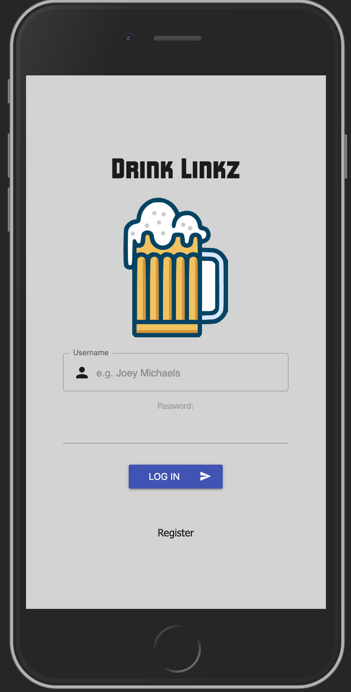
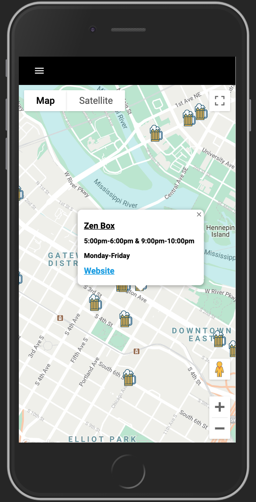
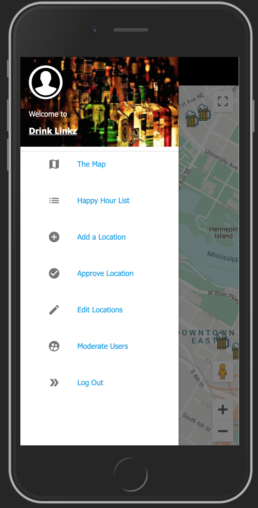

# Drink Linkz -

Drink Linkz - Alpha version

Two week solo project.

Drink Linkz is a mobile first web application designed to provide users with happy hour times in Minneapolis/ St. Paul area.
Happy hour locations and times are provided through crowd sourcing to ensure up-to-date times.

## Built With ... 

React, Redux, Redux-Sagas, Express, NodeJS, Passport, PostgreSQL, React Materialize CSS, Material-UI, Google Maps API, and the @react-google-maps/api library.

# Booting Up ... 

You will need the following 

- [Node.js](https://nodejs.org/en/)
- [Google Maps API](https://developers.google.com/maps/documentation)
- [PostrgeSQL](https://www.postgresql.org/)

### Installing

1. Download the files from the link from this repo.

2. Use the included database.sql file to create your database tables in a database to get started.

3. Create a .env file with your own SERVER_SESSION_SECRET and REACT_APP_GOOGLE_KEY for the google maps api.

4. Run the following commands:
   `npm install`
   `npm run server`
   `npm run client`

### Application View

Login Screen for users.

Homepage for all users with locations and information displayed.

Side Nav view for users. Top three option can be seen by all users and the remaining three by admin. 

### Future Updates

[ ] : Reintroduce Google Places API to find locations quicker. 

[ ] : Create a search function to find locations on the map and list.

[ ] : Introduce Google Geolocation finder so users can see their location.

### Thanks all!

Special thanks to my friends, family, cohort, and teachers for helping me create this. 
